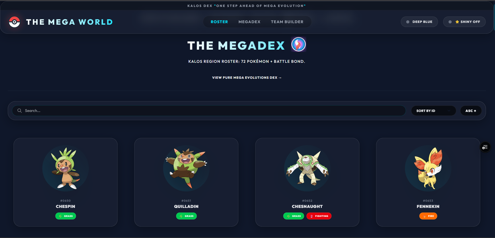
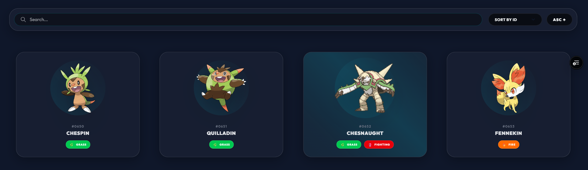
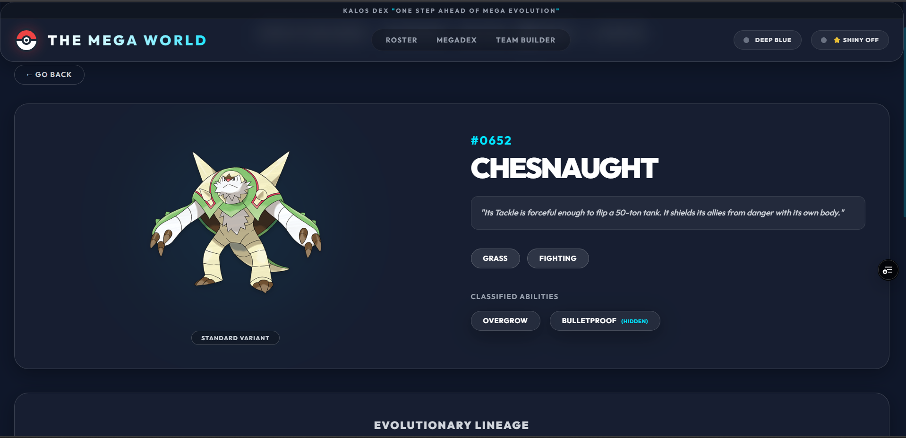
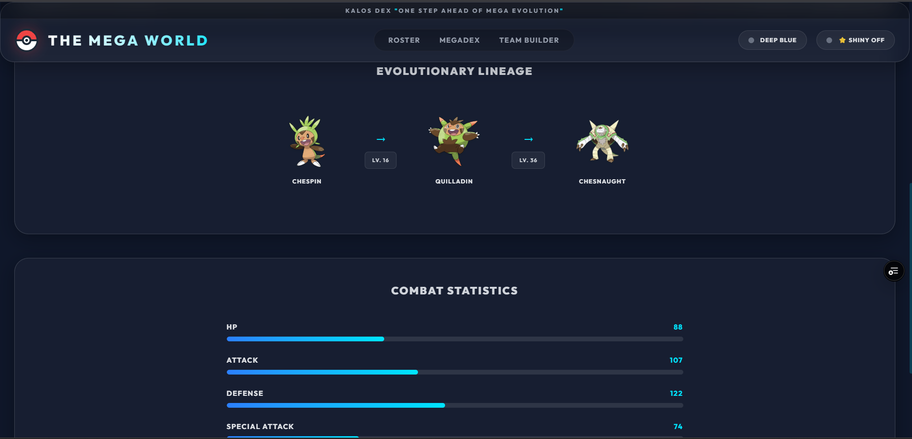
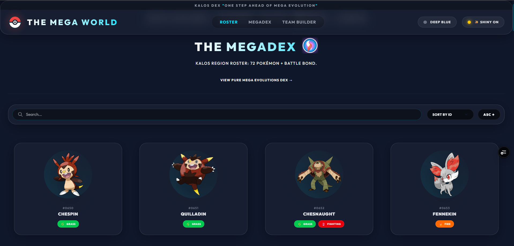

# 🌟 Kalos MegaDex

A premium, high‑performance Pokédex for the Kalos region—built with Vite + React, Tailwind v4, and Supabase. The app delivers a sleek dark‑mode UI, smooth micro‑animations, and a global **Shiny** toggle.

---

## 📸 Preview







---

## About

Kalos MegaDex combines modern design aesthetics with powerful features:
- **Deep Dark Slate Theme** with glass‑morphism panels.
- **Framer Motion** powered interactions for buttery‑smooth transitions.
- **Fully responsive** layout – looks great on phones, tablets, and ultra‑wide monitors.
- **Supabase authentication** (no custom backend needed).
- **Team Builder** to craft, save, and share your ultimate Kalos squads.

---

## How It Works

| Step | Description |
|------|--------------|
| **1️⃣ Sign‑up / Log‑in** | Supabase `signUp` and `signInWithPassword` handle secure authentication. |
| **2️⃣ Browse Pokémon** | Real‑time data fetched from the public **PokeAPI** (via `axios`). |
| **3️⃣ View Details** | Click a card → animated transition to the detail view with type badges and Mega‑Stone icon. |
| **4️⃣ Build a Team** | Drag‑and‑drop Pokémon, see type synergy, and view stat summaries. |
| **5️⃣ Save & Share** | Authenticated users persist teams; guests store them locally. |

---

## Features

### Core Features
- **Dynamic Pokédex** – Real‑time PokeAPI integration.
- **Mega Evolution Hub** – Dedicated section with custom Mega‑Stone SVG.
- **Team Builder** – Drag‑and‑drop roster with live stat calculations.
- **Global Shiny Toggle** – Switch all Pokémon images to their shiny variants.
- **Type System** – Color‑coded type badges with elegant icons.

### User‑Facing Features
- **Responsive UI** – `p-6 sm:p-10`, `max-w-[90%] sm:max-w-md`, fluid typography.
- **Theme Toggle** – Dark / Pitch‑Black mode persisted in `localStorage`.
- **Credits Banner** – Social‑media links (GitHub, LinkedIn, LeetCode, Instagram).
- **Smooth Animations** – 0.3 s transitions for hover, page entry, and mode switches.

---

## Tech Stack

| Layer | Technology |
|-------|------------|
| **Framework** | React 19 + Vite 8 |
| **Styling** | Tailwind CSS v4 (custom utilities, glass‑morphism) |
| **Animations** | Framer Motion |
| **Data** | PokeAPI (axios) |
| **Auth & DB** | Supabase (Auth + Postgres) |
| **Icons** | Lucide React |
| **Deploy** | Vercel (SPA with `vercel.json`) |

---

## Getting Started

### Prerequisites
- **Node.js** ≥ 18
- **npm**
- **Supabase** account (free tier works fine)

### 1️⃣ Clone the repository
```bash
git clone https://github.com/kanishk3114S/KalosPokeDex.git
cd KalosPokeDex
```

### 2️⃣ Install dependencies
```bash
npm install
```

### 3️⃣ Configure environment variables
Create a **.env** file at the project root (same level as `frontend/`):
```env
VITE_SUPABASE_URL="https://YOUR-PROJECT.supabase.co"
VITE_SUPABASE_ANON_KEY="YOUR-ANON-KEY"
```
> **Note:** Vercel does **not** read the local `.env`. Add the same variables in the Vercel dashboard under **Settings → Environment Variables** for production.

### 4️⃣ Run the app locally
```bash
npm run dev
```
Open `http://localhost:5173` (or the displayed port) to see the polished UI.

### 5️⃣ Build for production
```bash
npm run build
```
The output is placed in `frontend/dist/` ready for deployment.

---

## Deploying to Vercel
1. **Push to GitHub**
```bash
git add .
git commit -m "chore: ready for Vercel"
git push origin main
```
2. **Import the repo** on <https://vercel.com> – select the `frontend` directory as the root.
3. **Add Environment Variables** (`VITE_SUPABASE_URL`, `VITE_SUPABASE_ANON_KEY`).
4. **Deploy** – Vercel will run `npm run build` and serve the static site.

---

## Project Structure
```
KalosDex/
├─ preview/                # <-- screenshots used in the README
├─ backend/                # (removed – now using Supabase)
├─ frontend/
│  ├─ src/
│  │  ├─ components/      # Navbar, PokemonCard, Credits, etc.
│  │  ├─ context/        # ThemeContext, ShinyContext
│  │  ├─ pages/          # Dashboard, Login, MegaDex, TeamBuilder
│  │  ├─ supabase.js     # Supabase client init
│  │  └─ index.css
│  ├─ public/
│  ├─ tailwind.config.cjs
│  ├─ vite.config.js
│  └─ vercel.json        # SPA rewrite rule
├─ .env                    # Local Supabase env vars
└─ README.md
```

---

## Contributing
Contributions are welcome! Feel free to:
- Open issues for bugs or feature ideas.
- Submit pull requests with enhancements (new UI animations, additional Pokémon data, etc.).

Please follow the standard GitHub flow (branch → PR → review).

---

## License
This project is licensed under the **MIT License** – see the `LICENSE` file for details.

---

**Created by** – *Kanishk3114S* – 
[GitHub](https://github.com/dashboard) | [LinkedIn](https://www.linkedin.com/in/kanishk-sharma-b0912735a/) | [LeetCode](https://leetcode.com/u/KanishkSharma3114/) | [Instagram](https://www.instagram.com/kanishk_x_sharma/?hl=en)